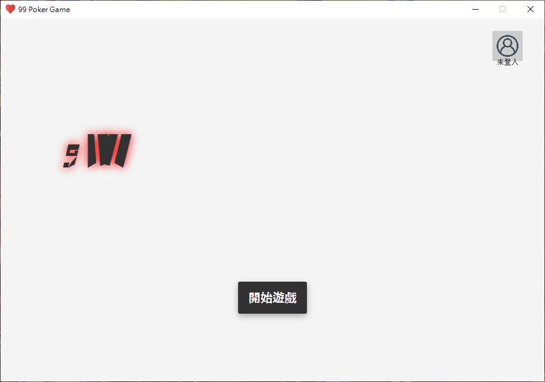
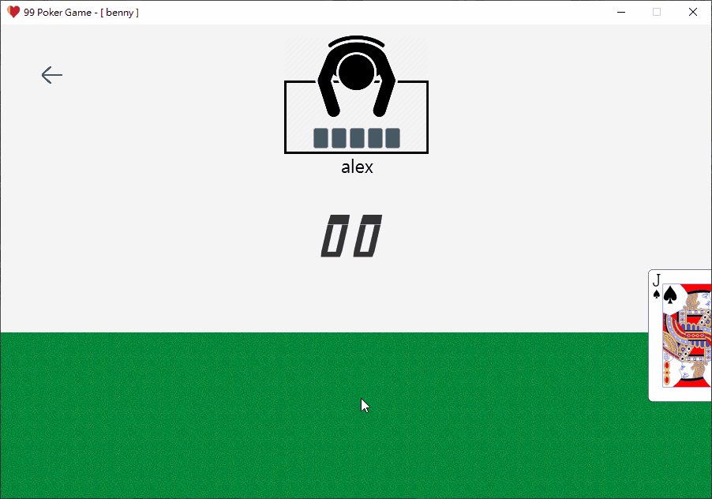
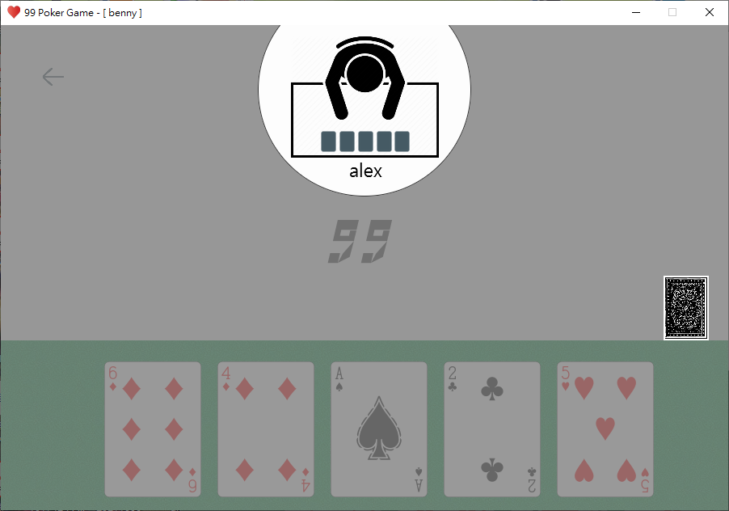
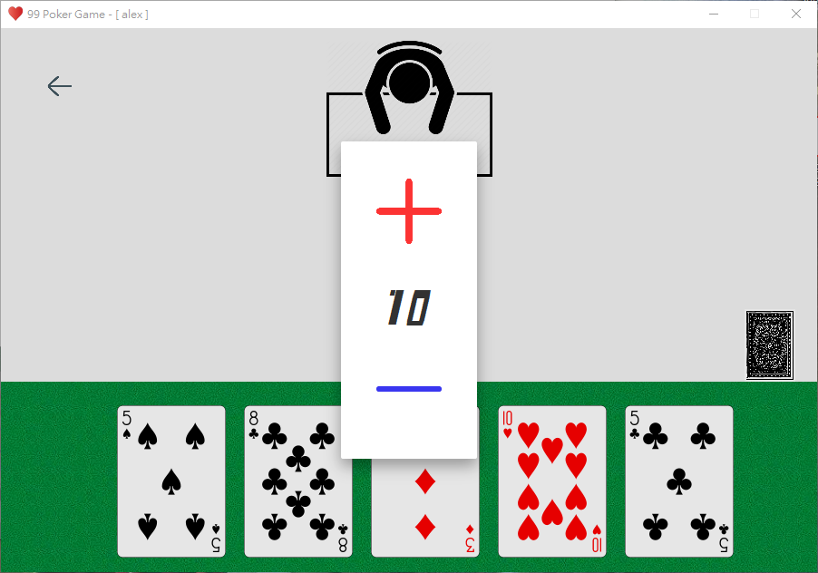
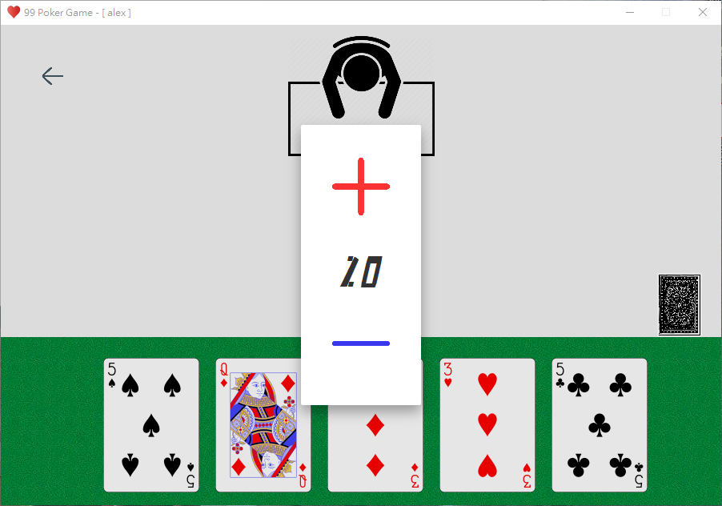
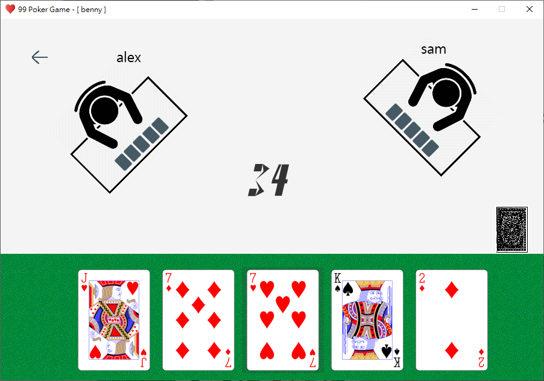
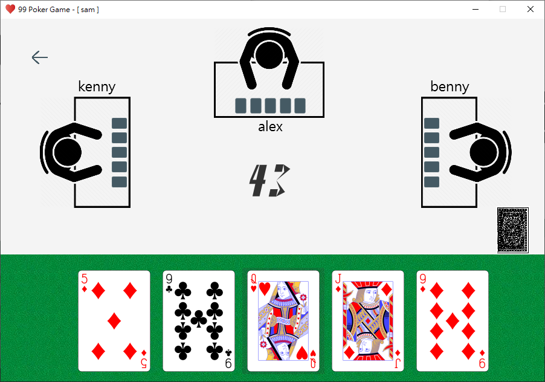
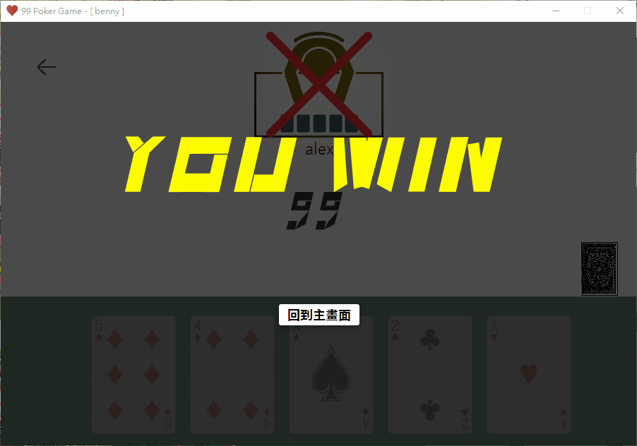
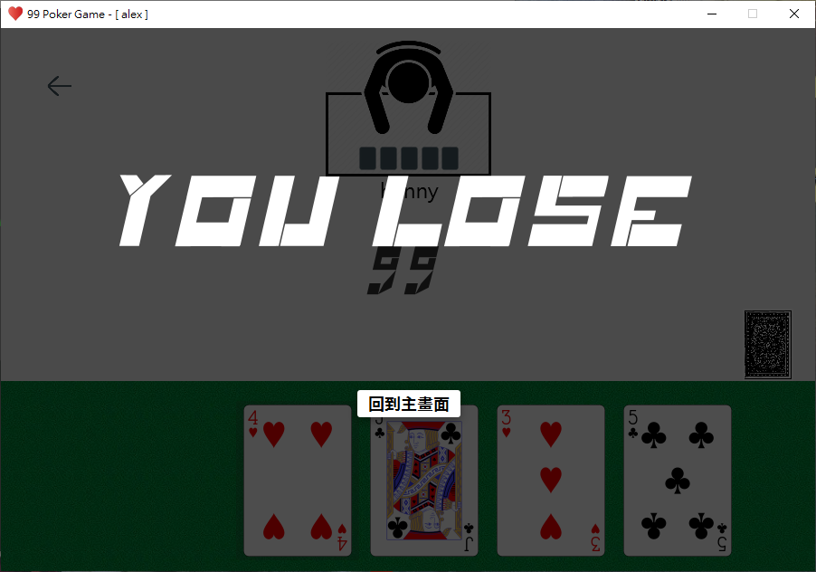

## 九九撲克牌遊戲

### Introduce

* 👨‍💻 使用 Java 開發

* 👤 使用者須登入才能遊玩

* ✔️ 支援2, 3, 4人連線對戰

* ✔️ 支援多個遊戲房間同時進行

### 遊戲介紹
遊戲開始後，每位使用者先從山(牌堆)中抽五張牌，接著使用者的出牌順序依照進入房間的順序開始。每回合使用者須選擇一張手牌丟到海(牌池)中，丟出去後再從山中抽一張牌回來，若山中無牌，則無須抽牌。每一張都出去的牌皆會改變海中的值，改變的原則是: 當你丟出什麼牌，就加上多少，例如丟出黑桃3，海的值就會+3，丟出紅心9，海的值就會+9。海的最大上限為99，若手中的每一張牌皆會使海中的值超過99的話，則淘汰。然而這樣的遊戲會非常無趣，因此改變了一些牌的功能，詳細如下:

| 牌 | 功能 |
| :---: | :---: | 
| 黑桃A  | 歸零 |
| 4  | 迴轉使用者發牌順序 |
| 5  | 指定使用者發牌 |
| 10 | +10 or -10 |
| J  | 跳過(不對海中的值做增減) |
| Q  | +20 or -20 |
| K  | 將海中的值加到99  |

當使用者的手牌都發完後，他就會成為贏家，若最後牌局中只剩一名玩家，該名玩家則為贏家。因此，在一場牌局當中，可能會出現多位贏家，也有可能沒有出現輸家。

### Screenshot

**主畫面**

**遊戲畫面**

**5撲克牌 (指定一位玩家)**

**10撲克牌 (+10 / -10)**

**Q撲克牌 (+20 / -20)**

**3人遊戲畫面**

**4人遊戲畫面**

**贏家畫面**

**輸家畫面**
